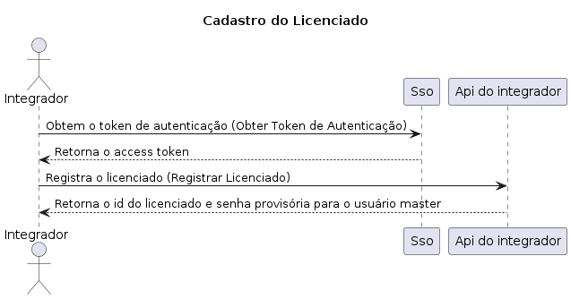
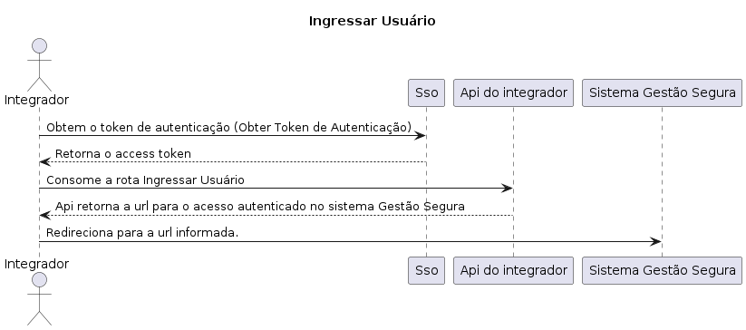

# Api Integradores

Esta API permite que integradores registrem licenciados e autentiquem usuários de outro sistema no sistema interno, sem a necessidade de passar pela tela de login.

## Menu

- [Obter Token de Autenticação](#obter-token-de-autenticação)
- [Registrar Licenciado](#registrar-licenciado)
- [Obter Grupos de Usuários](#obter-grupos-de-usuários)
- [Ingressar Usuário](#ingressar-usuário)

---

## Postman

[Baixar Coleção Postman - Sistema Gestão Segura](./Sistema%20Gestão%20Segura.postman_collection.json)

---

## Diagrama de Sequência - Cadastro de Licenciado



---

## Diagrama de Sequência - Ingresso do Usuário



---

## Obter Token de Autenticação

Este endpoint permite que o integrador obtenha um token de autenticação, que é necessário para realizar outras operações, como registrar licenciados e autenticar usuários.

**Método HTTP**: `POST`  
**URL**: `https://sso.gestaosegura.app/realms/admin/protocol/openid-connect/token`

### Headers

- `Content-Type: application/x-www-form-urlencoded`

### Corpo da Requisição

```json
{
    "client_id": "backoffice",
    "grant_type": "password",
    "username": "{{integradorUsuario}}",
    "password": "{{integradorSenha}}"
}
```

### Exemplo de Chamada com cURL

```bash
curl -X POST https://sso.gestaosegura.app/realms/admin/protocol/openid-connect/token -H "Content-Type: application/x-www-form-urlencoded" -d "client_id=backoffice" -d "grant_type=password" -d "username={{integradorUsuario}}" -d "password={{integradorSenha}}"
```

### Resposta de Sucesso (200 OK)

```json
{
    "access_token": "eyJhbGciOiJSUzI1NiIsInR5cCIgOiAiSldUIiwia2lkIiA6ICJhNks2...",
    "expires_in": 300,
    "refresh_expires_in": 1800,
    "refresh_token": "eyJhbGciOiJIUzUxMiIsInR5cCIgOiAiSldUIiwia2lkIiA6ICIx...",
    "token_type": "Bearer",
    "not-before-policy": 0,
    "session_state": "a00bbd6e-a728-44aa-b630-316db1dcbaac",
    "scope": "email profile"
}
```

---

## Registrar Licenciado

Este endpoint permite que o integrador registre um novo licenciado no sistema.

**Método HTTP**: `POST`  
**URL**: `https://api.gestaosegura.app/core/licenciados`

### Headers

- `Content-Type: application/json`
- `Authorization: Bearer {{token}}`

### Corpo da Requisição

```json
{
    "licenciado": {
        "telefone": "7",
        "email": "email@email.com.br",
        "responsavel": "Gilberto Ferreira",
        "codigoMobile": "10",
        "pessoaJuridica": {
            "razaoSocial": "Associacao Teste",
            "nomeFantasia": "Associacao Teste",
            "cnpj": "35796420000100"
        },
        "usuario": {
            "nome": "Teste",
            "sobrenome": "Teste",
            "email": "email@email.com.br",
            "login": "teste-01"
        },
        "endereco": {
            "logradouro": "Rua Desembargador Paulo Alonso",
            "complemento": "apt 204",
            "numero": "767",
            "bairro": "Recreio",
            "cidade": "Rio de Janeiro",
            "estado": "Rio de Janeiro",
            "pais": "Brasil",
            "cep": "22790540"
        }
    }
}
```

### Exemplo de Chamada com cURL

```bash
curl -X POST https://api.gestaosegura.app/core/licenciados -H "Content-Type: application/json" -H "Authorization: Bearer {{token}}" -d '{
    "licenciado": {
        "telefone": "7",
        "email": "email@email.com.br",
        "responsavel": "Gilberto Ferreira",
        "codigoMobile": "10",
        "pessoaJuridica": {
            "razaoSocial": "Associacao Teste",
            "nomeFantasia": "Associacao Teste",
            "cnpj": "35796420000100"
        },
        "usuario": {
            "nome": "Teste",
            "sobrenome": "Teste",
            "email": "email@email.com.br",
            "login": "teste-01"
        },
        "endereco": {
            "logradouro": "Rua Desembargador Paulo Alonso",
            "complemento": "apt 204",
            "numero": "767",
            "bairro": "Recreio",
            "cidade": "Rio de Janeiro",
            "estado": "Rio de Janeiro",
            "pais": "Brasil",
            "cep": "22790540"
        }
    }
}'
```

### Resposta de Sucesso (201 Created)

```json
{
    "licenciadoId": "5ccf4197-202a-4ab7-8f59-15676066dc0f",
    "senhaProvisoria": "**********"
}
```

## Obter Grupos de Usuários

Este endpoint permite que o integrador obtenha a lista de grupos de usuários configurados para um determinado licenciado. É importante para que o integrador saiba a quais grupos os usuários serão vinculados.

**Método HTTP**: `GET`  
**URL**: `https://api.gestaosegura.app/core/grupos/{{cnpj}}`

### Headers

- `Authorization: Bearer {{token}}`

### Descrição

A variável `{{cnpj}}` equivale a um CNPJ sem pontuação. Exemplo: 35796420000100.

### Exemplo de Chamada com cURL

```bash
curl -X GET https://api.gestaosegura.app/core/grupos/35796420000100 -H "Authorization: Bearer {{token}}"
```

### Resposta de Sucesso (200 OK)

```json
[
    "Administradores"
]
```

---

## Ingressar Usuário

Este endpoint permite que um usuário autenticado em outro sistema seja autenticado no sistema interno, sem a necessidade de passar pela tela de login.

**Método HTTP**: `POST`  
**URL**: `https://api.gestaosegura.app/core/acessos`

### Headers

- `Content-Type: application/json`
- `Authorization: Bearer {{token}}`

### Corpo da Requisição

```json
{
    "nomeDaAssociacao": "Nome da Associacao",
    "codigoMobile": "456",
    "cnpjDaAssociacao": "46901064000164",
    "usuario": {
        "nome": "Nome",
        "sobrenome": "Sobrenome",
        "email": "email@email.com",
        "username": "username",
        "acesso": [
            {
                "modulo": "Eventos",
                "perfil": "Administradores",
                "acessar": true
            }
        ]
    }
}
```

### Exemplo de Chamada com cURL

```bash
curl -X POST https://api.gestaosegura.app/core/acessos -H "Content-Type: application/json" -H "Authorization: Bearer {{token}}" -d '{
    "nomeDaAssociacao": "Nome da Associacao",
    "codigoMobile": "456",
    "cnpjDaAssociacao": "46901064000164",
    "usuario": {
        "nome": "Nome",
        "sobrenome": "Sobrenome",
        "email": "email@email.com",
        "username": "username",
        "acesso": [
            {
                "modulo": "Eventos",
                "perfil": "Administradores",
                "acessar": true
            }
        ]
    }
}'
```

### Resposta de Sucesso (200 OK)

```json
{
    "url": "https://gestaosegura.app/?a=044cd899-6fa4-436f-984c-b462ff2e326f",
    "token": "044cd899-6fa4-436f-984c-b462ff2e326f",
    "expiracao": "2024-09-03T14:32:31.7535329+00:00"
}
```

---

