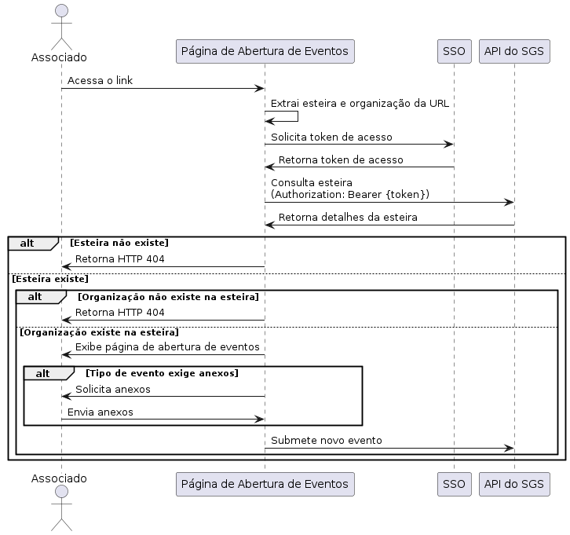

# Integração com a API do Sistema Gestão Segura

## 1) Sequência da Integração

Formato:

https://gestaosegura.com.br/?esteira={guid}&organizacao={guid}

Ex:

https://gestaosegura.com.br/?esteira=19e5463b-7832-4183-ac9e-f64159058de2&organizacao=60114dbc-d498-4658-8890-5a702a614e63

Quando o `associado` acessar o link acima, então a `página de abertura de eventos` deverá:
1) Extrair a `esteira` e `organização` informados via query string na url.
2) Obter o token de acesso para consumação da `Api do SGS`.
    - Descrito no passo 2.
3) Consultar a esteira pela Api do SGS`.
    - Descrito no passo 3.
    - Caso a esteira não exista, a página deve retornar http 404.
4) A partir da esteira, podemos consultar as organizações.
    - Caso a organização não exista, a página deve retornar http 404.
5) A esteira possui uma coleção de `tipos de eventos`, onde cada tipo indica se os anexos são obrigatórios ou não.
    - Se um tipo de evento exige um ou mais anexos, então a página de abertura de eventos somente deverá submeter um novo evento, caso os anexos sejam enviados.

### Diagrama de Sequência:



## 2) Obter o token de acesso pelo SSO.

Requisição:
```
curl --location 'https://sso.gestaosegura.app/realms/eventos/protocol/openid-connect/token' \
--header 'Content-Type: application/x-www-form-urlencoded' \
--data-urlencode 'client_id=painel' \
--data-urlencode 'grant_type=password' \
--data-urlencode 'username=usuario' \
--data-urlencode 'password=senha'
```

Modelo de Resposta:

```
{
    "access_token": "eyJhbGciOiJSUzI1NiIsInR5cCIgOiAiSldUIiwia2lkIiA6ICJqYnFZdlJSSGxJcUxveE45TjAyQUktY2lvX3E4c1RCaHJZVDNlZWtucFlzIn0.eyJleHAiOjE3MjIwMTYzNDgsImlhdCI6MTcyMjAxNjA0OCwianRpIjoiMDMxMDE5NDAtMTk5YS00NjhmLWE5NmYtMzE5YmJlZmRlYTE2IiwiaXNzIjoiaHR0cHM6Ly9zc28uZ2VzdGFvc2VndXJhLmFwcC9yZWFsbXMvZXZlbnRvcyIsImF1ZCI6WyJyZWFsbS1tYW5hZ2VtZW50IiwiYnJva2VyIiwiYWNjb3VudCJdLCJzdWIiOiIwNTg2MTZhOS04NjJmLTRmMGUtYTYzNi01ZmExOTY0ZjkwNGMiLCJ0eXAiOiJCZWFyZXIiLCJhenAiOiJwYWluZWwiLCJzZXNzaW9uX3N0YXRlIjoiNWY3ZDkwMjAtYjk1NS00YjE4LThhZjYtNDdjOGI0NjUzNGYwIiwiYWNyIjoiMSIsImFsbG93ZWQtb3JpZ2lucyI6WyJodHRwczovL3BhaW5lbC5nZXN0YW9zZWd1cmEuYXBwIiwiaHR0cHM6Ly9nZXN0YW9zZWd1cmEuYXBwIiwiaHR0cDovL2xvY2FsaG9zdDo0MjAwIiwiaHR0cHM6Ly93d3cuZ2VzdGFvc2VndXJhLmFwcCJdLCJyZWFsbV9hY2Nlc3MiOnsicm9sZXMiOlsiZGVmYXVsdC1yb2xlcy1ldmVudG9zIiwib2ZmbGluZV9hY2Nlc3MiLCJ1bWFfYXV0aG9yaXphdGlvbiJdfSwic2NvcGUiOiJlbWFpbCBwcm9maWxlIiwic2lkIjoiNWY3ZDkwMjAtYjk1NS00YjE4LThhZjYtNDdjOGI0NjUzNGYwIiwiZW1haWxfdmVyaWZpZWQiOnRydWUsInJvbGVzIjpbImV2ZW50b3MudmVpY3Vsb3MucmVtb3ZlciIsImZvcm5lY2Vkb3Jlcy5saXN0YXIiLCJ0aXBvcy5hdHVhbGl6YXIiLCJ0aXBvcy5leGNsdWlyIiwiZ2VzdGFvU2VndXJhIiwiZXZlbnRvcy5lbmNlcnJhciIsImNvbmZpZ3VyYWNvZXMuYWxlcnRhc0RlRXZlbnRvcy5jcmlhciIsImNvbmZpZ3VyYWNvZXMubGlzdGFyIiwidGlwb3MucmVhdGl2YXIiLCJmb3JuZWNlZG9yZXMucmVhdGl2YXIiLCJldmVudG9zLmNyaWFyIiwic2VnbWVudG9zLmF0dWFsaXphciIsImV2ZW50b3MuYW5vdGFjb2VzLmF0dWFsaXphciIsImV2ZW50b3MucGVzc29hcy5hZGljaW9uYXIiLCJmb3JuZWNlZG9yZXMuYXR1YWxpemFyIiwiZm9ybmVjZWRvcmVzLmluYXRpdmFyIiwiZXZlbnRvcy52ZWljdWxvcy5hZGljaW9uYXIiLCJhY2Vzc28uY3JpYXIiLCJzZWdtZW50b3MuY3JpYXIiLCJldmVudG9zLmFsdGVyYXJTdGF0dXMiLCJzZWdtZW50b3MuaW5hdGl2YXIiLCJzZWdtZW50b3MucmVhdGl2YXIiLCJmb3JuZWNlZG9yZXMuY3JpYXIiLCJldmVudG9zLnJlc29sdWNhb0RlQXRlbmRpbWVudG8iLCJldmVudG9zLmFub3RhY29lcy5leGNsdWlyIiwiZm9ybmVjZWRvcmVzLmFub3RhY29lcy5jcmlhciIsImV2ZW50b3MuZGVmaW5pckZvcm5lY2Vkb3IiLCJldmVudG9zLmFuZXhvcy5pbXBvcnRhciIsImZvcm5lY2Vkb3Jlcy5hbm90YWNvZXMuZXhjbHVpciIsInRpcG9zLmxpc3RhciIsImV2ZW50b3MuY29uZmlybWFjYW9EZUF0ZW5kaW1lbnRvUGVsb0Fzc29jaWFkbyIsImV2ZW50b3MudmVpY3Vsb3MuYXR1YWxpemFyIiwidGlwb3MuY3JpYXIiLCJzZWdtZW50b3MubGlzdGFyIiwiZXZlbnRvcy5wZXNzb2FzLnJlbW92ZXIiLCJldmVudG9zLmNvbmZpcm1hY2FvRGVBdGVuZGltZW50byIsImV2ZW50b3MuYW5vdGFjb2VzLmFkaWNpb25hciIsImV2ZW50b3MucGVzc29hcy5hdHVhbGl6YXIiLCJldmVudG9zLmxpc3RhciIsImZvcm5lY2Vkb3Jlcy5hbm90YWNvZXMuYXR1YWxpemFyIl0sIm5hbWUiOiJHZXN0w6NvIFNlZ3VyYSIsInByZWZlcnJlZF91c2VybmFtZSI6Imdlc3Rhb3NlZ3VyYSIsImdpdmVuX25hbWUiOiJHZXN0w6NvIiwiZmFtaWx5X25hbWUiOiJTZWd1cmEiLCJlbWFpbCI6ImdpbGJlcnRvLmZlcnJlaXJhQGhpbm92YS5jb20uYnIifQ.aXAdhn-t-I4YbZZY7WzrQJ6f71IhFCSH0P77h9NUStu8HoXJEwVbB8xgiOS_cxjjovVjbkyObA08onCHoG3AKUtBCwSynpTSVHsCP7MR1VYZ63SCwaEt8qFqjXHLFpjFChizeD_UGfonhuPDIVd17XKKdvQsBLPWCz9AdRgL0GYU0FzHUxvemq12vZTG1yOpzwJPDfIA2Mxvm_PEytPAZs1N7MQb5vHpDOjVBLGKRO3RKtImpJZq2F1ZF7r_wP5pse5gGm8oo2l7-BEmo_HCIBE3Y5OnUH8Oqzs6e7D2Vd-_E4ORQ-7jHYMAjVUr4YfAtEO5aP2HG4QSZaL7GZHdEg",
    "expires_in": 300,
    "refresh_expires_in": 1800,
    "refresh_token": "eyJhbGciOiJIUzUxMiIsInR5cCIgOiAiSldUIiwia2lkIiA6ICI4NWM0ZjU5My05NjYxLTRkYWEtYWI4MS1mM2QyOTlhMzNiNTAifQ.eyJleHAiOjE3MjIwMTc4NDgsImlhdCI6MTcyMjAxNjA0OCwianRpIjoiNjlhMWFmODktYjFjZi00MTliLWFmMjctNjAzNGI1MjljZTFkIiwiaXNzIjoiaHR0cHM6Ly9zc28uZ2VzdGFvc2VndXJhLmFwcC9yZWFsbXMvZXZlbnRvcyIsImF1ZCI6Imh0dHBzOi8vc3NvLmdlc3Rhb3NlZ3VyYS5hcHAvcmVhbG1zL2V2ZW50b3MiLCJzdWIiOiIwNTg2MTZhOS04NjJmLTRmMGUtYTYzNi01ZmExOTY0ZjkwNGMiLCJ0eXAiOiJSZWZyZXNoIiwiYXpwIjoicGFpbmVsIiwic2Vzc2lvbl9zdGF0ZSI6IjVmN2Q5MDIwLWI5NTUtNGIxOC04YWY2LTQ3YzhiNDY1MzRmMCIsInNjb3BlIjoiZW1haWwgcHJvZmlsZSIsInNpZCI6IjVmN2Q5MDIwLWI5NTUtNGIxOC04YWY2LTQ3YzhiNDY1MzRmMCJ9.aRPeByM_lC-Ly4EG34elTiLQX3Ybc4c8ZraVrqvqNKfS1TI7KfSLuXPEQ5uicTPgfrNgL9-uyywvR9Pz5gWUNg",
    "token_type": "Bearer",
    "not-before-policy": 0,
    "session_state": "5f7d9020-b955-4b18-8af6-47c8b46534f0",
    "scope": "email profile"
}
```

> Precisamos obter o access token contido na resposta.

## 3) Consulta da Esteira

Requisição:
```
curl --location 'https://api.gestaosegura.app/core/processos/daa3b996-a51f-4ac2-aee9-35235d41df25' \
--header 'Authorization: Bearer {acess_token}'
```

Resposta:
```
{
    "nome": "Gestão Segura",
    "descricao": "",
    "tiposDeEventos": [
        {
            "nome": "Roubo",
            "descricao": "",
            "codigo": "R",
            "severidade": "Alta",
            "rating": 2,
            "usoDeAnexos": "NaoAplicavel",
            "descricaoDaSeveridade": "Alta",
            "tags": "Roubo,Alta,False,6b789522-0bf7-4e9c-b74e-1404d2eb502f,NaoAplicavel",
            "id": "6b789522-0bf7-4e9c-b74e-1404d2eb502f",
            "cadastro": "2024-06-11T17:31:46.584Z",
            "atualizacao": "2024-07-26T13:20:50.947Z",
            "ativo": false,
            "tenant": "e8e4d989-3b37-4f98-936d-4d188b02beca",
            "tenantName": "Gestão Segura"
        },
        {
            "nome": "Furto",
            "descricao": "",
            "codigo": "F",
            "severidade": "Alta",
            "rating": 2,
            "usoDeAnexos": "NaoAplicavel",
            "descricaoDaSeveridade": "Alta",
            "tags": "Furto,Alta,False,ab112ae6-6b2f-4b6d-b56a-439eb2fca1b7,NaoAplicavel",
            "id": "ab112ae6-6b2f-4b6d-b56a-439eb2fca1b7",
            "cadastro": "2024-06-11T17:31:46.585Z",
            "atualizacao": "2024-07-26T13:20:50.947Z",
            "ativo": false,
            "tenant": "e8e4d989-3b37-4f98-936d-4d188b02beca",
            "tenantName": "Gestão Segura"
        },
        {
            "nome": "Incêndio",
            "descricao": "",
            "codigo": "I",
            "severidade": "Alta",
            "rating": 2,
            "usoDeAnexos": "TodosOsAnexos",
            "descricaoDaSeveridade": "Alta",
            "tags": "Incêndio,Alta,False,47214f17-aa02-4fbf-a92f-5a729fec4fe3,TodosOsAnexos",
            "id": "47214f17-aa02-4fbf-a92f-5a729fec4fe3",
            "cadastro": "2024-06-12T14:32:01.281Z",
            "atualizacao": "2024-07-26T13:20:50.947Z",
            "ativo": false,
            "tenant": "e8e4d989-3b37-4f98-936d-4d188b02beca",
            "tenantName": "Gestão Segura"
        },
        {
            "nome": "Vidros",
            "descricao": "",
            "codigo": "V",
            "severidade": "Alta",
            "rating": 2,
            "usoDeAnexos": "UmAnexo",
            "descricaoDaSeveridade": "Alta",
            "tags": "Vidros,Alta,False,a01b9089-04e7-495e-b3ef-66c966252408,UmAnexo",
            "id": "a01b9089-04e7-495e-b3ef-66c966252408",
            "cadastro": "2024-06-12T14:32:01.281Z",
            "atualizacao": "2024-07-26T13:20:50.947Z",
            "ativo": false,
            "tenant": "e8e4d989-3b37-4f98-936d-4d188b02beca",
            "tenantName": "Gestão Segura"
        },
        {
            "nome": "Terceiro",
            "descricao": "",
            "codigo": "3",
            "severidade": "Baixa",
            "rating": 0,
            "usoDeAnexos": "NaoAplicavel",
            "descricaoDaSeveridade": "Baixa",
            "tags": "Terceiro,Baixa,True,704882ff-04cf-4a76-85a9-3a0171ac9833,NaoAplicavel",
            "id": "704882ff-04cf-4a76-85a9-3a0171ac9833",
            "cadastro": "2024-06-28T18:25:25.559Z",
            "atualizacao": "2024-07-26T13:20:50.947Z",
            "ativo": true,
            "tenant": "e8e4d989-3b37-4f98-936d-4d188b02beca",
            "tenantName": "Gestão Segura"
        },
        {
            "nome": "Associado",
            "descricao": "",
            "codigo": "0",
            "severidade": "Baixa",
            "rating": 0,
            "usoDeAnexos": "NaoAplicavel",
            "descricaoDaSeveridade": "Baixa",
            "tags": "Associado,Baixa,True,88c363d3-c70d-4cf8-951d-3339974a54b5,NaoAplicavel",
            "id": "88c363d3-c70d-4cf8-951d-3339974a54b5",
            "cadastro": "2024-06-28T18:25:25.559Z",
            "atualizacao": "2024-07-26T13:20:50.947Z",
            "ativo": true,
            "tenant": "e8e4d989-3b37-4f98-936d-4d188b02beca",
            "tenantName": "Gestão Segura"
        }
    ],
    "etapas": [
        {
            "nome": "Abertura",
            "descricao": "",
            "ordem": 0,
            "status": [
                {
                    "nome": "No prazo",
                    "cor": "#4CAF50",
                    "tempo": 1440,
                    "ordem": 0,
                    "habilitado": true,
                    "tipoDeTempo": "Dias",
                    "usaDiasUteis": true,
                    "id": "1ed5848f-6fcf-425a-be99-22c986603d44",
                    "cadastro": "2024-07-26T12:01:04.142Z",
                    "atualizacao": "2024-07-26T13:20:50.936Z",
                    "ativo": true,
                    "tenant": "e8e4d989-3b37-4f98-936d-4d188b02beca",
                    "tenantName": "Gestão Segura"
                },
                {
                    "nome": "Alerta",
                    "cor": "#FFC107",
                    "tempo": 1440,
                    "ordem": 1,
                    "habilitado": true,
                    "tipoDeTempo": "Dias",
                    "usaDiasUteis": true,
                    "id": "5b8763b5-36be-42ff-8624-1e7d71ec3da2",
                    "cadastro": "2024-07-26T12:01:04.142Z",
                    "atualizacao": "2024-07-26T13:20:50.937Z",
                    "ativo": true,
                    "tenant": "e8e4d989-3b37-4f98-936d-4d188b02beca",
                    "tenantName": "Gestão Segura"
                },
                {
                    "nome": "Critico",
                    "cor": "#F44336",
                    "tempo": 1440,
                    "ordem": 2,
                    "habilitado": true,
                    "tipoDeTempo": "Dias",
                    "usaDiasUteis": true,
                    "id": "a01e6ee7-5afb-4d22-aea7-746604f3b0e0",
                    "cadastro": "2024-07-26T12:01:04.142Z",
                    "atualizacao": "2024-07-26T13:20:50.937Z",
                    "ativo": true,
                    "tenant": "e8e4d989-3b37-4f98-936d-4d188b02beca",
                    "tenantName": "Gestão Segura"
                }
            ],
            "fases": [
                {
                    "nome": "Aberto - não inciado",
                    "id": "8c0f07bc-c1d4-406a-8c12-1aca58a00543",
                    "cadastro": "2024-06-18T15:02:42.917Z",
                    "atualizacao": "2024-07-26T13:20:50.937Z",
                    "ativo": true,
                    "tenant": "e8e4d989-3b37-4f98-936d-4d188b02beca",
                    "tenantName": "Gestão Segura"
                },
                {
                    "nome": "Em execução - iniciado",
                    "id": "5a738c68-2ee6-4d39-a5cd-bf00850f27a3",
                    "cadastro": "2024-06-18T15:02:42.919Z",
                    "atualizacao": "2024-07-26T13:20:50.937Z",
                    "ativo": true,
                    "tenant": "e8e4d989-3b37-4f98-936d-4d188b02beca",
                    "tenantName": "Gestão Segura"
                },
                {
                    "nome": "Em atendimento - liberado",
                    "id": "7fdcd541-e433-451c-842f-4ef77193b801",
                    "cadastro": "2024-06-18T15:02:42.92Z",
                    "atualizacao": "2024-07-26T13:20:50.937Z",
                    "ativo": true,
                    "tenant": "e8e4d989-3b37-4f98-936d-4d188b02beca",
                    "tenantName": "Gestão Segura"
                },
                {
                    "nome": "Atendimento pendente",
                    "id": "1b7a1b48-271f-4847-8054-607d15723d5d",
                    "cadastro": "2024-06-18T15:02:42.92Z",
                    "atualizacao": "2024-07-26T13:20:50.937Z",
                    "ativo": true,
                    "tenant": "e8e4d989-3b37-4f98-936d-4d188b02beca",
                    "tenantName": "Gestão Segura"
                },
                {
                    "nome": "Atendimento comunicado",
                    "id": "1cc335ed-1903-4270-a302-b85bf933e2be",
                    "cadastro": "2024-06-18T15:02:42.92Z",
                    "atualizacao": "2024-07-26T13:20:50.937Z",
                    "ativo": true,
                    "tenant": "e8e4d989-3b37-4f98-936d-4d188b02beca",
                    "tenantName": "Gestão Segura"
                }
            ],
            "tarefas": [
                {
                    "nome": "CNH do Associado",
                    "tipo": "VerdadeiroOuFalso",
                    "obrigatoria": false,
                    "opcoes": [],
                    "id": "d39058d7-1d5c-4390-965f-e1f5cb1e3651",
                    "cadastro": "2024-07-26T12:01:04.147Z",
                    "atualizacao": "2024-07-26T13:20:50.937Z",
                    "ativo": true,
                    "tenant": "e8e4d989-3b37-4f98-936d-4d188b02beca",
                    "tenantName": "Gestão Segura"
                },
                {
                    "nome": "CNH do Condutor",
                    "tipo": "VerdadeiroOuFalso",
                    "obrigatoria": false,
                    "opcoes": [],
                    "id": "63245cd6-1193-4f41-a16b-8e0426f88ef2",
                    "cadastro": "2024-07-26T12:01:04.148Z",
                    "atualizacao": "2024-07-26T13:20:50.937Z",
                    "ativo": true,
                    "tenant": "e8e4d989-3b37-4f98-936d-4d188b02beca",
                    "tenantName": "Gestão Segura"
                },
                {
                    "nome": "CRLV do Veículo",
                    "tipo": "VerdadeiroOuFalso",
                    "obrigatoria": false,
                    "opcoes": [],
                    "id": "312b0dd8-d2b5-4083-8335-bde129e77748",
                    "cadastro": "2024-07-26T12:01:04.148Z",
                    "atualizacao": "2024-07-26T13:20:50.937Z",
                    "ativo": true,
                    "tenant": "e8e4d989-3b37-4f98-936d-4d188b02beca",
                    "tenantName": "Gestão Segura"
                },
                {
                    "nome": "Fotos dos Danos",
                    "tipo": "VerdadeiroOuFalso",
                    "obrigatoria": false,
                    "opcoes": [],
                    "id": "b1781a2c-c747-46a1-8690-11ec0e68c09b",
                    "cadastro": "2024-07-26T12:01:04.148Z",
                    "atualizacao": "2024-07-26T13:20:50.937Z",
                    "ativo": true,
                    "tenant": "e8e4d989-3b37-4f98-936d-4d188b02beca",
                    "tenantName": "Gestão Segura"
                },
                {
                    "nome": "Evoluir para card de análise",
                    "tipo": "VerdadeiroOuFalso",
                    "obrigatoria": true,
                    "opcoes": [],
                    "id": "9e5407e0-2f4c-43b3-9e8b-ae7c194bfd6d",
                    "cadastro": "2024-07-26T12:01:04.148Z",
                    "atualizacao": "2024-07-26T13:20:50.937Z",
                    "ativo": true,
                    "tenant": "e8e4d989-3b37-4f98-936d-4d188b02beca",
                    "tenantName": "Gestão Segura"
                }
            ],
            "id": "64f16612-ae8b-402d-ac50-aa5e3d6316ec",
            "cadastro": "2024-06-11T17:31:46.581Z",
            "atualizacao": "2024-07-26T13:20:50.936Z",
            "ativo": true,
            "tenant": "e8e4d989-3b37-4f98-936d-4d188b02beca",
            "tenantName": "Gestão Segura"
        },
        {
            "nome": "Análise",
            "descricao": "",
            "ordem": 1,
            "status": [
                {
                    "nome": "No prazo",
                    "cor": "#4CAF50",
                    "tempo": 1440,
                    "ordem": 0,
                    "habilitado": true,
                    "tipoDeTempo": "Dias",
                    "usaDiasUteis": true,
                    "id": "591fb10e-d796-455f-be21-a854d1dcb474",
                    "cadastro": "2024-07-26T12:02:49.304Z",
                    "atualizacao": "2024-07-26T13:20:50.938Z",
                    "ativo": true,
                    "tenant": "e8e4d989-3b37-4f98-936d-4d188b02beca",
                    "tenantName": "Gestão Segura"
                },
                {
                    "nome": "Alerta",
                    "cor": "#FFC107",
                    "tempo": 1440,
                    "ordem": 1,
                    "habilitado": true,
                    "tipoDeTempo": "Dias",
                    "usaDiasUteis": true,
                    "id": "be281b9a-ba77-4eef-b1e4-e564d9d940d5",
                    "cadastro": "2024-07-26T12:02:49.304Z",
                    "atualizacao": "2024-07-26T13:20:50.938Z",
                    "ativo": true,
                    "tenant": "e8e4d989-3b37-4f98-936d-4d188b02beca",
                    "tenantName": "Gestão Segura"
                },
                {
                    "nome": "Critico",
                    "cor": "#F44336",
                    "tempo": 1440,
                    "ordem": 2,
                    "habilitado": true,
                    "tipoDeTempo": "Dias",
                    "usaDiasUteis": true,
                    "id": "61b867f3-7fa3-4b75-9544-5e28f79b1300",
                    "cadastro": "2024-07-26T12:02:49.304Z",
                    "atualizacao": "2024-07-26T13:20:50.938Z",
                    "ativo": true,
                    "tenant": "e8e4d989-3b37-4f98-936d-4d188b02beca",
                    "tenantName": "Gestão Segura"
                }
            ],
            "fases": [
                {
                    "nome": "Aberto - não iniciado",
                    "id": "cbb6ac1c-518a-4c3e-91dd-14bce7ba357b",
                    "cadastro": "2024-06-18T15:05:07.29Z",
                    "atualizacao": "2024-07-26T13:20:50.938Z",
                    "ativo": true,
                    "tenant": "e8e4d989-3b37-4f98-936d-4d188b02beca",
                    "tenantName": "Gestão Segura"
                },
                {
                    "nome": "Em execução - iniciado",
                    "id": "2b2d798b-9602-4e0f-a0ef-faab692f3051",
                    "cadastro": "2024-06-18T15:05:07.291Z",
                    "atualizacao": "2024-07-26T13:20:50.938Z",
                    "ativo": true,
                    "tenant": "e8e4d989-3b37-4f98-936d-4d188b02beca",
                    "tenantName": "Gestão Segura"
                },
                {
                    "nome": "Liberado",
                    "id": "a2dac1f6-e007-413f-9362-1e0a1e0a86fb",
                    "cadastro": "2024-06-18T15:05:07.291Z",
                    "atualizacao": "2024-07-26T13:20:50.938Z",
                    "ativo": true,
                    "tenant": "e8e4d989-3b37-4f98-936d-4d188b02beca",
                    "tenantName": "Gestão Segura"
                },
                {
                    "nome": "Pendente",
                    "id": "c94a7ff2-da04-403f-8908-0983073a7560",
                    "cadastro": "2024-06-18T15:05:07.291Z",
                    "atualizacao": "2024-07-26T13:20:50.938Z",
                    "ativo": true,
                    "tenant": "e8e4d989-3b37-4f98-936d-4d188b02beca",
                    "tenantName": "Gestão Segura"
                },
                {
                    "nome": "Negado",
                    "id": "ddc056dd-e39c-4b26-a964-7fd6d75dd07f",
                    "cadastro": "2024-06-18T15:05:07.291Z",
                    "atualizacao": "2024-07-26T13:20:50.938Z",
                    "ativo": true,
                    "tenant": "e8e4d989-3b37-4f98-936d-4d188b02beca",
                    "tenantName": "Gestão Segura"
                },
                {
                    "nome": "Sindicância",
                    "id": "2c97d434-5a87-4c1c-9fce-982819764f0d",
                    "cadastro": "2024-06-18T15:05:07.291Z",
                    "atualizacao": "2024-07-26T13:20:50.938Z",
                    "ativo": true,
                    "tenant": "e8e4d989-3b37-4f98-936d-4d188b02beca",
                    "tenantName": "Gestão Segura"
                },
                {
                    "nome": "Perícia",
                    "id": "dbd006da-2f31-4a40-9402-5da9fd67f7cf",
                    "cadastro": "2024-06-18T15:05:07.291Z",
                    "atualizacao": "2024-07-26T13:20:50.938Z",
                    "ativo": true,
                    "tenant": "e8e4d989-3b37-4f98-936d-4d188b02beca",
                    "tenantName": "Gestão Segura"
                },
                {
                    "nome": "Jurídica",
                    "id": "9865c698-f0fd-4276-b594-6b0f4c21732a",
                    "cadastro": "2024-06-18T15:05:07.291Z",
                    "atualizacao": "2024-07-26T13:20:50.938Z",
                    "ativo": true,
                    "tenant": "e8e4d989-3b37-4f98-936d-4d188b02beca",
                    "tenantName": "Gestão Segura"
                },
                {
                    "nome": "Diretoria",
                    "id": "cae96728-e13b-402d-83da-e34680e97fe0",
                    "cadastro": "2024-06-18T15:05:07.291Z",
                    "atualizacao": "2024-07-26T13:20:50.938Z",
                    "ativo": true,
                    "tenant": "e8e4d989-3b37-4f98-936d-4d188b02beca",
                    "tenantName": "Gestão Segura"
                },
                {
                    "nome": "Pendente de liberação supervisão",
                    "id": "3d230695-d8bc-4322-b5d9-f38caed85d16",
                    "cadastro": "2024-06-18T15:05:07.291Z",
                    "atualizacao": "2024-07-26T13:20:50.938Z",
                    "ativo": true,
                    "tenant": "e8e4d989-3b37-4f98-936d-4d188b02beca",
                    "tenantName": "Gestão Segura"
                },
                {
                    "nome": "Comunicada",
                    "id": "3cd445ca-10c6-48e2-852c-39dc1c4060c9",
                    "cadastro": "2024-06-18T15:05:07.291Z",
                    "atualizacao": "2024-07-26T13:20:50.938Z",
                    "ativo": true,
                    "tenant": "e8e4d989-3b37-4f98-936d-4d188b02beca",
                    "tenantName": "Gestão Segura"
                }
            ],
            "tarefas": [
                {
                    "nome": "Análise iniciada",
                    "tipo": "VerdadeiroOuFalso",
                    "obrigatoria": false,
                    "opcoes": [],
                    "id": "6125240c-d782-419a-9f29-0dd1629fbf55",
                    "cadastro": "2024-07-26T12:02:49.305Z",
                    "atualizacao": "2024-07-26T13:20:50.938Z",
                    "ativo": true,
                    "tenant": "e8e4d989-3b37-4f98-936d-4d188b02beca",
                    "tenantName": "Gestão Segura"
                },
                {
                    "nome": "Análise Concluída",
                    "tipo": "VerdadeiroOuFalso",
                    "obrigatoria": false,
                    "opcoes": [],
                    "id": "cda70fc9-256c-471a-ad3c-bbfba88d2371",
                    "cadastro": "2024-07-26T12:02:49.305Z",
                    "atualizacao": "2024-07-26T13:20:50.938Z",
                    "ativo": true,
                    "tenant": "e8e4d989-3b37-4f98-936d-4d188b02beca",
                    "tenantName": "Gestão Segura"
                },
                {
                    "nome": "Evoluir card para comunicação",
                    "tipo": "VerdadeiroOuFalso",
                    "obrigatoria": false,
                    "opcoes": [],
                    "id": "fa979c0a-e83c-4575-aa9d-3701422031cd",
                    "cadastro": "2024-07-26T12:02:49.305Z",
                    "atualizacao": "2024-07-26T13:20:50.938Z",
                    "ativo": true,
                    "tenant": "e8e4d989-3b37-4f98-936d-4d188b02beca",
                    "tenantName": "Gestão Segura"
                },
                {
                    "nome": "Marcar paralização por motivos de sindicância",
                    "tipo": "VerdadeiroOuFalso",
                    "obrigatoria": false,
                    "opcoes": [],
                    "id": "be0ab75c-2ac8-4c9a-b6ae-22fdbff3fdfd",
                    "cadastro": "2024-07-26T12:02:49.306Z",
                    "atualizacao": "2024-07-26T13:20:50.938Z",
                    "ativo": true,
                    "tenant": "e8e4d989-3b37-4f98-936d-4d188b02beca",
                    "tenantName": "Gestão Segura"
                }
            ],
            "id": "616cb285-7e0c-4239-8a57-c6c1f4641595",
            "cadastro": "2024-06-11T17:31:46.582Z",
            "atualizacao": "2024-07-26T13:20:50.938Z",
            "ativo": true,
            "tenant": "e8e4d989-3b37-4f98-936d-4d188b02beca",
            "tenantName": "Gestão Segura"
        },
        {
            "nome": "Jurídico - retorno após a análise",
            "descricao": "",
            "ordem": 2,
            "status": [
                {
                    "nome": "No prazo",
                    "cor": "#4CAF50",
                    "tempo": 4320,
                    "ordem": 0,
                    "habilitado": true,
                    "tipoDeTempo": "Dias",
                    "usaDiasUteis": true,
                    "id": "c3f28e54-5f5e-4574-bda1-4241c98d504b",
                    "cadastro": "2024-07-26T12:03:50.923Z",
                    "atualizacao": "2024-07-26T13:20:50.939Z",
                    "ativo": true,
                    "tenant": "e8e4d989-3b37-4f98-936d-4d188b02beca",
                    "tenantName": "Gestão Segura"
                },
                {
                    "nome": "Alerta",
                    "cor": "#FFC107",
                    "tempo": 4320,
                    "ordem": 1,
                    "habilitado": true,
                    "tipoDeTempo": "Dias",
                    "usaDiasUteis": true,
                    "id": "b9783a50-c622-478a-9717-d1868e0a47a8",
                    "cadastro": "2024-07-26T12:03:50.923Z",
                    "atualizacao": "2024-07-26T13:20:50.939Z",
                    "ativo": true,
                    "tenant": "e8e4d989-3b37-4f98-936d-4d188b02beca",
                    "tenantName": "Gestão Segura"
                },
                {
                    "nome": "Critico",
                    "cor": "#F44336",
                    "tempo": 4320,
                    "ordem": 2,
                    "habilitado": true,
                    "tipoDeTempo": "Dias",
                    "usaDiasUteis": true,
                    "id": "29373792-e785-41ed-ae2e-4c9223a171b3",
                    "cadastro": "2024-07-26T12:03:50.923Z",
                    "atualizacao": "2024-07-26T13:20:50.939Z",
                    "ativo": true,
                    "tenant": "e8e4d989-3b37-4f98-936d-4d188b02beca",
                    "tenantName": "Gestão Segura"
                }
            ],
            "tarefas": [
                {
                    "nome": "Solic. comunicado ao dep. jurídico",
                    "tipo": "VerdadeiroOuFalso",
                    "obrigatoria": false,
                    "opcoes": [],
                    "id": "18da103c-ae3c-4c71-9d44-719a7c568ad7",
                    "cadastro": "2024-07-04T13:13:47.501Z",
                    "atualizacao": "2024-07-26T13:20:50.939Z",
                    "ativo": true,
                    "tenant": "e8e4d989-3b37-4f98-936d-4d188b02beca",
                    "tenantName": "Gestão Segura"
                },
                {
                    "nome": "Envio do comunicado ao associado",
                    "tipo": "VerdadeiroOuFalso",
                    "obrigatoria": false,
                    "opcoes": [],
                    "id": "da2ec84f-f5ce-4c70-84f5-07eb651bb08b",
                    "cadastro": "2024-07-04T13:13:47.501Z",
                    "atualizacao": "2024-07-26T13:20:50.939Z",
                    "ativo": true,
                    "tenant": "e8e4d989-3b37-4f98-936d-4d188b02beca",
                    "tenantName": "Gestão Segura"
                },
                {
                    "nome": "Reanálise",
                    "descricao": "",
                    "tipo": "VerdadeiroOuFalso",
                    "obrigatoria": false,
                    "opcoes": [],
                    "id": "f4d09bd9-4f54-4a34-9010-10eab1708e10",
                    "cadastro": "2024-07-04T13:13:47.502Z",
                    "atualizacao": "2024-07-26T13:20:50.939Z",
                    "ativo": true,
                    "tenant": "e8e4d989-3b37-4f98-936d-4d188b02beca",
                    "tenantName": "Gestão Segura"
                },
                {
                    "nome": "Envio do parecer da reanálise",
                    "tipo": "CaixaDeSelecao",
                    "obrigatoria": false,
                    "opcoes": [
                        {
                            "nome": "Sim",
                            "id": "dfa93d49-4d30-4ad5-b599-9f30f5db096c",
                            "cadastro": "2024-07-04T13:13:47.502Z",
                            "ativo": true,
                            "tenant": "e8e4d989-3b37-4f98-936d-4d188b02beca",
                            "tenantName": "Gestão Segura"
                        },
                        {
                            "nome": "Não",
                            "id": "b155457b-0866-4651-b7dc-c9bfb8d36243",
                            "cadastro": "2024-07-04T13:13:47.502Z",
                            "ativo": true,
                            "tenant": "e8e4d989-3b37-4f98-936d-4d188b02beca",
                            "tenantName": "Gestão Segura"
                        },
                        {
                            "nome": "Não se aplica",
                            "id": "36994235-3c85-4279-9d5a-1ac037a07f1a",
                            "cadastro": "2024-07-04T13:13:47.502Z",
                            "ativo": true,
                            "tenant": "e8e4d989-3b37-4f98-936d-4d188b02beca",
                            "tenantName": "Gestão Segura"
                        }
                    ],
                    "id": "72ce2832-e1cd-4d7f-baa0-13a55b510011",
                    "cadastro": "2024-07-04T13:13:47.502Z",
                    "atualizacao": "2024-07-26T13:20:50.939Z",
                    "ativo": true,
                    "tenant": "e8e4d989-3b37-4f98-936d-4d188b02beca",
                    "tenantName": "Gestão Segura"
                },
                {
                    "nome": "Mover card para Conclusão caso seja mantida a negativa",
                    "tipo": "VerdadeiroOuFalso",
                    "obrigatoria": false,
                    "opcoes": [],
                    "id": "923de389-c13b-48e9-ae6b-ab4710e548c4",
                    "cadastro": "2024-07-26T12:03:50.923Z",
                    "atualizacao": "2024-07-26T13:20:50.94Z",
                    "ativo": true,
                    "tenant": "e8e4d989-3b37-4f98-936d-4d188b02beca",
                    "tenantName": "Gestão Segura"
                },
                {
                    "nome": "Mover card para Comunicação pós análise caso seja DEFERIDO",
                    "tipo": "VerdadeiroOuFalso",
                    "obrigatoria": false,
                    "opcoes": [],
                    "id": "be457aca-f0a3-400c-80ab-13c4ad625417",
                    "cadastro": "2024-07-26T12:03:50.924Z",
                    "atualizacao": "2024-07-26T13:20:50.94Z",
                    "ativo": true,
                    "tenant": "e8e4d989-3b37-4f98-936d-4d188b02beca",
                    "tenantName": "Gestão Segura"
                }
            ],
            "id": "10bf610e-4638-4b0c-9a82-d9884770f892",
            "cadastro": "2024-06-28T19:00:15.577Z",
            "atualizacao": "2024-07-26T13:20:50.939Z",
            "ativo": true,
            "tenant": "e8e4d989-3b37-4f98-936d-4d188b02beca",
            "tenantName": "Gestão Segura"
        },
        {
            "nome": "Comunicação - Retorno pós análise",
            "descricao": "",
            "ordem": 3,
            "status": [
                {
                    "nome": "No prazo",
                    "cor": "#4CAF50",
                    "tempo": 1440,
                    "ordem": 0,
                    "habilitado": true,
                    "tipoDeTempo": "Dias",
                    "usaDiasUteis": true,
                    "id": "5580ebe1-0ec2-43cd-a1c7-a4cc1e938dde",
                    "cadastro": "2024-07-26T12:05:03.84Z",
                    "atualizacao": "2024-07-26T13:20:50.94Z",
                    "ativo": true,
                    "tenant": "e8e4d989-3b37-4f98-936d-4d188b02beca",
                    "tenantName": "Gestão Segura"
                },
                {
                    "nome": "Alerta",
                    "cor": "#FFC107",
                    "tempo": 1440,
                    "ordem": 1,
                    "habilitado": true,
                    "tipoDeTempo": "Dias",
                    "usaDiasUteis": true,
                    "id": "cf5b2168-7d0d-4e38-9e92-17be922bb731",
                    "cadastro": "2024-07-26T12:05:03.841Z",
                    "atualizacao": "2024-07-26T13:20:50.94Z",
                    "ativo": true,
                    "tenant": "e8e4d989-3b37-4f98-936d-4d188b02beca",
                    "tenantName": "Gestão Segura"
                },
                {
                    "nome": "Critico",
                    "cor": "#F44336",
                    "tempo": 1440,
                    "ordem": 2,
                    "habilitado": true,
                    "tipoDeTempo": "Dias",
                    "usaDiasUteis": true,
                    "id": "a4d15b75-ffc2-4d7d-8e8f-17fc0dc6792a",
                    "cadastro": "2024-07-26T12:05:03.841Z",
                    "atualizacao": "2024-07-26T13:20:50.94Z",
                    "ativo": true,
                    "tenant": "e8e4d989-3b37-4f98-936d-4d188b02beca",
                    "tenantName": "Gestão Segura"
                }
            ],
            "tarefas": [
                {
                    "nome": "Comunicar deferimento",
                    "tipo": "VerdadeiroOuFalso",
                    "obrigatoria": true,
                    "opcoes": [],
                    "id": "637118e4-3ad5-4ccd-a7ca-fd0ad9986de6",
                    "cadastro": "2024-07-04T13:19:36.67Z",
                    "atualizacao": "2024-07-26T13:20:50.94Z",
                    "ativo": true,
                    "tenant": "e8e4d989-3b37-4f98-936d-4d188b02beca",
                    "tenantName": "Gestão Segura"
                },
                {
                    "nome": "Solicitar pagamento da participação",
                    "tipo": "VerdadeiroOuFalso",
                    "obrigatoria": true,
                    "opcoes": [],
                    "id": "c7214b0a-b7a2-4dc5-b45d-708226c529d8",
                    "cadastro": "2024-07-04T13:19:36.67Z",
                    "atualizacao": "2024-07-26T13:20:50.94Z",
                    "ativo": true,
                    "tenant": "e8e4d989-3b37-4f98-936d-4d188b02beca",
                    "tenantName": "Gestão Segura"
                },
                {
                    "nome": "Solicitar termo de sub-rogação ",
                    "tipo": "CaixaDeSelecao",
                    "obrigatoria": false,
                    "opcoes": [
                        {
                            "nome": "Solicitado",
                            "id": "0cc66208-6f93-487a-a250-552cf7be60fb",
                            "cadastro": "2024-07-04T13:19:36.67Z",
                            "ativo": true,
                            "tenant": "e8e4d989-3b37-4f98-936d-4d188b02beca",
                            "tenantName": "Gestão Segura"
                        },
                        {
                            "nome": "Não se aplica",
                            "id": "b4233641-a7be-4ce4-827c-f6c79d1338d8",
                            "cadastro": "2024-07-04T13:19:36.67Z",
                            "ativo": true,
                            "tenant": "e8e4d989-3b37-4f98-936d-4d188b02beca",
                            "tenantName": "Gestão Segura"
                        }
                    ],
                    "id": "6c875f94-2d33-4a23-b03a-5cb28377f3d6",
                    "cadastro": "2024-07-04T13:19:36.67Z",
                    "atualizacao": "2024-07-26T13:20:50.94Z",
                    "ativo": true,
                    "tenant": "e8e4d989-3b37-4f98-936d-4d188b02beca",
                    "tenantName": "Gestão Segura"
                },
                {
                    "nome": "Indicação de oficina ao associado",
                    "tipo": "VerdadeiroOuFalso",
                    "obrigatoria": false,
                    "opcoes": [],
                    "id": "b14f40d1-823f-4ba1-a21b-6efdd91ddb51",
                    "cadastro": "2024-07-04T13:19:36.671Z",
                    "atualizacao": "2024-07-26T13:20:50.94Z",
                    "ativo": true,
                    "tenant": "e8e4d989-3b37-4f98-936d-4d188b02beca",
                    "tenantName": "Gestão Segura"
                },
                {
                    "nome": "Comunicação à oficina do direcionamento do veículo",
                    "tipo": "VerdadeiroOuFalso",
                    "obrigatoria": false,
                    "opcoes": [],
                    "id": "0cc4a311-4574-49fc-ad0d-9d628a347821",
                    "cadastro": "2024-07-04T13:19:36.671Z",
                    "atualizacao": "2024-07-26T13:20:50.94Z",
                    "ativo": true,
                    "tenant": "e8e4d989-3b37-4f98-936d-4d188b02beca",
                    "tenantName": "Gestão Segura"
                },
                {
                    "nome": "Orçamento particular",
                    "tipo": "CaixaDeSelecao",
                    "obrigatoria": false,
                    "opcoes": [
                        {
                            "nome": "Solicitado",
                            "id": "631c0794-e124-4f09-9b4e-0b117b3bdcc1",
                            "cadastro": "2024-07-04T13:19:36.671Z",
                            "ativo": true,
                            "tenant": "e8e4d989-3b37-4f98-936d-4d188b02beca",
                            "tenantName": "Gestão Segura"
                        },
                        {
                            "nome": "Não se aplica",
                            "id": "4fbc5e2e-538b-4664-b759-b6b478b59280",
                            "cadastro": "2024-07-04T13:19:36.671Z",
                            "ativo": true,
                            "tenant": "e8e4d989-3b37-4f98-936d-4d188b02beca",
                            "tenantName": "Gestão Segura"
                        }
                    ],
                    "id": "bc79f98f-0190-4a45-9b0f-677771ca2cee",
                    "cadastro": "2024-07-04T13:19:36.671Z",
                    "atualizacao": "2024-07-26T13:20:50.94Z",
                    "ativo": true,
                    "tenant": "e8e4d989-3b37-4f98-936d-4d188b02beca",
                    "tenantName": "Gestão Segura"
                },
                {
                    "nome": "Lançar na planilha do BI - Evento em andamento",
                    "tipo": "VerdadeiroOuFalso",
                    "obrigatoria": true,
                    "opcoes": [],
                    "id": "56e76b49-3876-4496-b40a-491783edf70e",
                    "cadastro": "2024-07-04T13:19:36.672Z",
                    "atualizacao": "2024-07-26T13:20:50.941Z",
                    "ativo": true,
                    "tenant": "e8e4d989-3b37-4f98-936d-4d188b02beca",
                    "tenantName": "Gestão Segura"
                },
                {
                    "nome": "Evolução do Processo no Sistema para Aguar. Ret. Assoc",
                    "tipo": "VerdadeiroOuFalso",
                    "obrigatoria": false,
                    "opcoes": [],
                    "id": "c79b612f-2598-422f-9018-06e341dcfa3d",
                    "cadastro": "2024-07-26T12:05:03.841Z",
                    "atualizacao": "2024-07-26T13:20:50.941Z",
                    "ativo": true,
                    "tenant": "e8e4d989-3b37-4f98-936d-4d188b02beca",
                    "tenantName": "Gestão Segura"
                }
            ],
            "id": "c814f0d6-b730-4c4d-b007-892ef7840950",
            "cadastro": "2024-07-04T13:14:40.319Z",
            "atualizacao": "2024-07-26T13:20:50.94Z",
            "ativo": true,
            "tenant": "e8e4d989-3b37-4f98-936d-4d188b02beca",
            "tenantName": "Gestão Segura"
        },
        {
            "nome": "Comunicação aguardando retorno do assoc/terceiro",
            "descricao": "",
            "ordem": 4,
            "status": [
                {
                    "nome": "No prazo",
                    "cor": "#4CAF50",
                    "tempo": 1440,
                    "ordem": 0,
                    "habilitado": true,
                    "tipoDeTempo": "Dias",
                    "usaDiasUteis": true,
                    "id": "63e72695-086c-4c93-829a-bcfbe2bbd03b",
                    "cadastro": "2024-07-26T12:06:56.328Z",
                    "atualizacao": "2024-07-26T13:20:50.941Z",
                    "ativo": true,
                    "tenant": "e8e4d989-3b37-4f98-936d-4d188b02beca",
                    "tenantName": "Gestão Segura"
                },
                {
                    "nome": "Alerta",
                    "cor": "#FFC107",
                    "tempo": 1440,
                    "ordem": 1,
                    "habilitado": true,
                    "tipoDeTempo": "Dias",
                    "usaDiasUteis": true,
                    "id": "37c0c022-8942-4543-a4c7-607a8866fdbe",
                    "cadastro": "2024-07-26T12:06:56.329Z",
                    "atualizacao": "2024-07-26T13:20:50.941Z",
                    "ativo": true,
                    "tenant": "e8e4d989-3b37-4f98-936d-4d188b02beca",
                    "tenantName": "Gestão Segura"
                },
                {
                    "nome": "Critico",
                    "cor": "#F44336",
                    "tempo": 1440,
                    "ordem": 2,
                    "habilitado": true,
                    "tipoDeTempo": "Dias",
                    "usaDiasUteis": true,
                    "id": "be583ca4-bfa6-4f01-94b0-2d33fe8d4296",
                    "cadastro": "2024-07-26T12:06:56.329Z",
                    "atualizacao": "2024-07-26T13:20:50.941Z",
                    "ativo": true,
                    "tenant": "e8e4d989-3b37-4f98-936d-4d188b02beca",
                    "tenantName": "Gestão Segura"
                }
            ],
            "tarefas": [
                {
                    "nome": "Pagamento da participação",
                    "tipo": "CaixaDeSelecao",
                    "obrigatoria": false,
                    "opcoes": [
                        {
                            "nome": "Sim",
                            "id": "4f0be0a1-7c5b-45a4-aeab-7d98b1ba9d92",
                            "cadastro": "2024-07-26T12:06:56.33Z",
                            "ativo": true,
                            "tenant": "e8e4d989-3b37-4f98-936d-4d188b02beca",
                            "tenantName": "Gestão Segura"
                        },
                        {
                            "nome": "Não se aplica",
                            "id": "9c772e57-cdf2-4f2e-b1ee-7008ce44fe44",
                            "cadastro": "2024-07-26T12:06:56.33Z",
                            "ativo": true,
                            "tenant": "e8e4d989-3b37-4f98-936d-4d188b02beca",
                            "tenantName": "Gestão Segura"
                        }
                    ],
                    "id": "0fdaf8de-bc2a-4dbd-b08e-4720a49f7c48",
                    "cadastro": "2024-07-04T13:41:02.544Z",
                    "atualizacao": "2024-07-26T13:20:50.941Z",
                    "ativo": true,
                    "tenant": "e8e4d989-3b37-4f98-936d-4d188b02beca",
                    "tenantName": "Gestão Segura"
                },
                {
                    "nome": "Data do pagamento da participação",
                    "tipo": "DataEHora",
                    "obrigatoria": false,
                    "opcoes": [],
                    "id": "ea847bc7-a0ab-4263-bb68-8e505b30e2f7",
                    "cadastro": "2024-07-04T13:43:03.063Z",
                    "atualizacao": "2024-07-26T13:20:50.941Z",
                    "ativo": true,
                    "tenant": "e8e4d989-3b37-4f98-936d-4d188b02beca",
                    "tenantName": "Gestão Segura"
                },
                {
                    "nome": "Termo de sub-rogação firmado",
                    "tipo": "CaixaDeSelecao",
                    "obrigatoria": false,
                    "opcoes": [
                        {
                            "nome": "Sim",
                            "id": "e81c941a-636d-4028-8e02-1b2cdee290db",
                            "cadastro": "2024-07-26T12:06:56.33Z",
                            "ativo": true,
                            "tenant": "e8e4d989-3b37-4f98-936d-4d188b02beca",
                            "tenantName": "Gestão Segura"
                        },
                        {
                            "nome": "Não se aplica",
                            "id": "311ec096-727e-4088-9227-7f871aa8b33c",
                            "cadastro": "2024-07-26T12:06:56.331Z",
                            "ativo": true,
                            "tenant": "e8e4d989-3b37-4f98-936d-4d188b02beca",
                            "tenantName": "Gestão Segura"
                        }
                    ],
                    "id": "42f4d9c9-69dc-4775-8d07-705945bdacb1",
                    "cadastro": "2024-07-04T13:43:03.063Z",
                    "atualizacao": "2024-07-26T13:20:50.941Z",
                    "ativo": true,
                    "tenant": "e8e4d989-3b37-4f98-936d-4d188b02beca",
                    "tenantName": "Gestão Segura"
                },
                {
                    "nome": "Data do termo de sub-rogação firmado",
                    "tipo": "DataEHora",
                    "obrigatoria": false,
                    "opcoes": [],
                    "id": "523d6ca3-c8b1-4b81-873c-da2347f1e791",
                    "cadastro": "2024-07-04T13:43:03.064Z",
                    "atualizacao": "2024-07-26T13:20:50.941Z",
                    "ativo": true,
                    "tenant": "e8e4d989-3b37-4f98-936d-4d188b02beca",
                    "tenantName": "Gestão Segura"
                },
                {
                    "nome": "Confirmação da entrada do veículo na oficina",
                    "tipo": "DataEHora",
                    "obrigatoria": false,
                    "opcoes": [],
                    "id": "bbcae6ca-fb4b-4546-97ac-4b0b3f19bd91",
                    "cadastro": "2024-07-04T13:43:03.064Z",
                    "atualizacao": "2024-07-26T13:20:50.941Z",
                    "ativo": true,
                    "tenant": "e8e4d989-3b37-4f98-936d-4d188b02beca",
                    "tenantName": "Gestão Segura"
                },
                {
                    "nome": "Recebimento do orçamento",
                    "tipo": "DataEHora",
                    "obrigatoria": false,
                    "opcoes": [],
                    "id": "09768656-4911-4947-8cc3-86442a2123cf",
                    "cadastro": "2024-07-04T13:43:03.064Z",
                    "atualizacao": "2024-07-26T13:20:50.941Z",
                    "ativo": true,
                    "tenant": "e8e4d989-3b37-4f98-936d-4d188b02beca",
                    "tenantName": "Gestão Segura"
                },
                {
                    "nome": "Evolução do processo no sistema para Regulação",
                    "tipo": "VerdadeiroOuFalso",
                    "obrigatoria": false,
                    "opcoes": [],
                    "id": "6360a715-8e1d-4ae7-97fc-b7fe77aef399",
                    "cadastro": "2024-07-26T12:06:56.329Z",
                    "atualizacao": "2024-07-26T13:20:50.941Z",
                    "ativo": true,
                    "tenant": "e8e4d989-3b37-4f98-936d-4d188b02beca",
                    "tenantName": "Gestão Segura"
                }
            ],
            "id": "7276feb7-7d52-4f57-8e27-0eadaabaa85d",
            "cadastro": "2024-07-04T13:37:03.413Z",
            "atualizacao": "2024-07-26T13:20:50.941Z",
            "ativo": true,
            "tenant": "e8e4d989-3b37-4f98-936d-4d188b02beca",
            "tenantName": "Gestão Segura"
        },
        {
            "nome": "Cotação/Regulação",
            "descricao": "",
            "ordem": 5,
            "status": [
                {
                    "nome": "No prazo",
                    "cor": "#4CAF50",
                    "tempo": 1440,
                    "ordem": 0,
                    "habilitado": true,
                    "tipoDeTempo": "Dias",
                    "usaDiasUteis": true,
                    "id": "9d0ca10f-ca79-49ce-a916-62531ab60396",
                    "cadastro": "2024-07-26T12:08:35.207Z",
                    "atualizacao": "2024-07-26T13:20:50.942Z",
                    "ativo": true,
                    "tenant": "e8e4d989-3b37-4f98-936d-4d188b02beca",
                    "tenantName": "Gestão Segura"
                },
                {
                    "nome": "Alerta",
                    "cor": "#FFC107",
                    "tempo": 1440,
                    "ordem": 1,
                    "habilitado": true,
                    "tipoDeTempo": "Dias",
                    "usaDiasUteis": true,
                    "id": "05341ae4-1710-4ce7-be8c-c546a61a73ad",
                    "cadastro": "2024-07-26T12:08:35.207Z",
                    "atualizacao": "2024-07-26T13:20:50.942Z",
                    "ativo": true,
                    "tenant": "e8e4d989-3b37-4f98-936d-4d188b02beca",
                    "tenantName": "Gestão Segura"
                },
                {
                    "nome": "Critico",
                    "cor": "#F44336",
                    "tempo": 1440,
                    "ordem": 2,
                    "habilitado": true,
                    "tipoDeTempo": "Dias",
                    "usaDiasUteis": true,
                    "id": "16bacf0c-d001-48ca-87dc-61882dab701d",
                    "cadastro": "2024-07-26T12:08:35.207Z",
                    "atualizacao": "2024-07-26T13:20:50.942Z",
                    "ativo": true,
                    "tenant": "e8e4d989-3b37-4f98-936d-4d188b02beca",
                    "tenantName": "Gestão Segura"
                }
            ],
            "fases": [
                {
                    "nome": "Não iniciada",
                    "id": "49575194-4917-4e71-a0d3-2703b297e17d",
                    "cadastro": "2024-06-18T15:07:41.341Z",
                    "atualizacao": "2024-07-26T13:20:50.942Z",
                    "ativo": true,
                    "tenant": "e8e4d989-3b37-4f98-936d-4d188b02beca",
                    "tenantName": "Gestão Segura"
                },
                {
                    "nome": "Em execução - iniciado",
                    "id": "f665a064-4561-41e5-879e-22e13c4292e2",
                    "cadastro": "2024-06-18T15:07:41.341Z",
                    "atualizacao": "2024-07-26T13:20:50.942Z",
                    "ativo": true,
                    "tenant": "e8e4d989-3b37-4f98-936d-4d188b02beca",
                    "tenantName": "Gestão Segura"
                },
                {
                    "nome": "Atendimento para terceiro",
                    "id": "6804b6dc-c956-443e-8703-822d7af18e01",
                    "cadastro": "2024-06-18T15:07:41.341Z",
                    "atualizacao": "2024-07-26T13:20:50.942Z",
                    "ativo": true,
                    "tenant": "e8e4d989-3b37-4f98-936d-4d188b02beca",
                    "tenantName": "Gestão Segura"
                },
                {
                    "nome": "Liberado",
                    "id": "57084a9b-e093-418a-a1f7-1d190633b0fa",
                    "cadastro": "2024-06-18T15:07:41.341Z",
                    "atualizacao": "2024-07-26T13:20:50.942Z",
                    "ativo": true,
                    "tenant": "e8e4d989-3b37-4f98-936d-4d188b02beca",
                    "tenantName": "Gestão Segura"
                },
                {
                    "nome": "Pendente",
                    "id": "374be560-3a91-45e9-b0b9-99c9eeae7340",
                    "cadastro": "2024-06-18T15:07:41.341Z",
                    "atualizacao": "2024-07-26T13:20:50.942Z",
                    "ativo": true,
                    "tenant": "e8e4d989-3b37-4f98-936d-4d188b02beca",
                    "tenantName": "Gestão Segura"
                }
            ],
            "tarefas": [
                {
                    "nome": "Cotação",
                    "tipo": "DataEHora",
                    "obrigatoria": false,
                    "opcoes": [],
                    "id": "beacf80e-3404-4f64-b517-6c853dc05425",
                    "cadastro": "2024-07-26T12:08:35.208Z",
                    "atualizacao": "2024-07-26T13:20:50.942Z",
                    "ativo": true,
                    "tenant": "e8e4d989-3b37-4f98-936d-4d188b02beca",
                    "tenantName": "Gestão Segura"
                },
                {
                    "nome": "Regulação do orçamento",
                    "tipo": "DataEHora",
                    "obrigatoria": false,
                    "opcoes": [],
                    "id": "327b65b3-934b-4667-b79b-7734b63f6750",
                    "cadastro": "2024-07-26T12:08:35.208Z",
                    "atualizacao": "2024-07-26T13:20:50.942Z",
                    "ativo": true,
                    "tenant": "e8e4d989-3b37-4f98-936d-4d188b02beca",
                    "tenantName": "Gestão Segura"
                },
                {
                    "nome": "Negociação oficina",
                    "tipo": "VerdadeiroOuFalso",
                    "obrigatoria": false,
                    "opcoes": [],
                    "id": "eb2a4355-ade8-4a7a-9dbd-4ff39c028125",
                    "cadastro": "2024-07-26T12:08:35.208Z",
                    "atualizacao": "2024-07-26T13:20:50.942Z",
                    "ativo": true,
                    "tenant": "e8e4d989-3b37-4f98-936d-4d188b02beca",
                    "tenantName": "Gestão Segura"
                }
            ],
            "id": "a7579b0f-f860-4168-846b-a948430240a3",
            "cadastro": "2024-06-11T17:31:46.583Z",
            "atualizacao": "2024-07-26T13:20:50.942Z",
            "ativo": true,
            "tenant": "e8e4d989-3b37-4f98-936d-4d188b02beca",
            "tenantName": "Gestão Segura"
        },
        {
            "nome": "Auditoria do orçamento",
            "descricao": "",
            "ordem": 6,
            "status": [
                {
                    "nome": "No prazo",
                    "cor": "#4CAF50",
                    "tempo": 1440,
                    "ordem": 0,
                    "habilitado": true,
                    "tipoDeTempo": "Dias",
                    "usaDiasUteis": true,
                    "id": "550407c5-53b1-458c-a837-7ab4bad2ba2d",
                    "cadastro": "2024-07-26T12:10:17.363Z",
                    "atualizacao": "2024-07-26T13:20:50.943Z",
                    "ativo": true,
                    "tenant": "e8e4d989-3b37-4f98-936d-4d188b02beca",
                    "tenantName": "Gestão Segura"
                },
                {
                    "nome": "Alerta",
                    "cor": "#FFC107",
                    "tempo": 1440,
                    "ordem": 1,
                    "habilitado": true,
                    "tipoDeTempo": "Dias",
                    "usaDiasUteis": true,
                    "id": "0adb313c-02d6-43a0-8389-02bac2a9b0bb",
                    "cadastro": "2024-07-26T12:10:17.363Z",
                    "atualizacao": "2024-07-26T13:20:50.943Z",
                    "ativo": true,
                    "tenant": "e8e4d989-3b37-4f98-936d-4d188b02beca",
                    "tenantName": "Gestão Segura"
                },
                {
                    "nome": "Critico",
                    "cor": "#F44336",
                    "tempo": 1440,
                    "ordem": 2,
                    "habilitado": true,
                    "tipoDeTempo": "Dias",
                    "usaDiasUteis": true,
                    "id": "15944cf7-cb8e-4689-9402-7bbdb2b50721",
                    "cadastro": "2024-07-26T12:10:17.363Z",
                    "atualizacao": "2024-07-26T13:20:50.943Z",
                    "ativo": true,
                    "tenant": "e8e4d989-3b37-4f98-936d-4d188b02beca",
                    "tenantName": "Gestão Segura"
                }
            ],
            "tarefas": [
                {
                    "nome": "Edição do orçamento",
                    "tipo": "DataEHora",
                    "obrigatoria": false,
                    "opcoes": [],
                    "id": "4a20631d-49de-4bc7-ad63-8073dd0fb2da",
                    "cadastro": "2024-07-26T12:10:17.363Z",
                    "atualizacao": "2024-07-26T13:20:50.943Z",
                    "ativo": true,
                    "tenant": "e8e4d989-3b37-4f98-936d-4d188b02beca",
                    "tenantName": "Gestão Segura"
                },
                {
                    "nome": "Auditoria do Orçamento ",
                    "tipo": "DataEHora",
                    "obrigatoria": false,
                    "opcoes": [],
                    "id": "48534f35-eaf9-4695-b0a4-8880548e735f",
                    "cadastro": "2024-07-26T12:10:17.363Z",
                    "atualizacao": "2024-07-26T13:20:50.943Z",
                    "ativo": true,
                    "tenant": "e8e4d989-3b37-4f98-936d-4d188b02beca",
                    "tenantName": "Gestão Segura"
                },
                {
                    "nome": "Evolução do Processo para  Comunicação pós Regulagem ",
                    "tipo": "VerdadeiroOuFalso",
                    "obrigatoria": false,
                    "opcoes": [],
                    "id": "74166deb-984d-4a12-8828-11abba44bf2a",
                    "cadastro": "2024-07-26T12:10:17.364Z",
                    "atualizacao": "2024-07-26T13:20:50.943Z",
                    "ativo": true,
                    "tenant": "e8e4d989-3b37-4f98-936d-4d188b02beca",
                    "tenantName": "Gestão Segura"
                }
            ],
            "id": "9beb14a7-99f6-45b4-b6d5-8b9beb539264",
            "cadastro": "2024-07-26T12:09:15.817Z",
            "atualizacao": "2024-07-26T13:20:50.943Z",
            "ativo": true,
            "tenant": "e8e4d989-3b37-4f98-936d-4d188b02beca",
            "tenantName": "Gestão Segura"
        },
        {
            "nome": "Orçamento complementar",
            "descricao": "",
            "ordem": 7,
            "status": [
                {
                    "nome": "No prazo",
                    "cor": "#4CAF50",
                    "tempo": 1440,
                    "ordem": 0,
                    "habilitado": true,
                    "tipoDeTempo": "Dias",
                    "usaDiasUteis": true,
                    "id": "37dc816e-accf-42ab-8a16-553f6a35cd90",
                    "cadastro": "2024-07-26T12:11:01.411Z",
                    "atualizacao": "2024-07-26T13:20:50.943Z",
                    "ativo": true,
                    "tenant": "e8e4d989-3b37-4f98-936d-4d188b02beca",
                    "tenantName": "Gestão Segura"
                },
                {
                    "nome": "Alerta",
                    "cor": "#FFC107",
                    "tempo": 1440,
                    "ordem": 1,
                    "habilitado": true,
                    "tipoDeTempo": "Dias",
                    "usaDiasUteis": true,
                    "id": "12f53353-4736-4c55-b2bb-9b71ac724ac8",
                    "cadastro": "2024-07-26T12:11:01.411Z",
                    "atualizacao": "2024-07-26T13:20:50.943Z",
                    "ativo": true,
                    "tenant": "e8e4d989-3b37-4f98-936d-4d188b02beca",
                    "tenantName": "Gestão Segura"
                },
                {
                    "nome": "Critico",
                    "cor": "#F44336",
                    "tempo": 1440,
                    "ordem": 2,
                    "habilitado": true,
                    "tipoDeTempo": "Dias",
                    "usaDiasUteis": true,
                    "id": "76b901be-f9a8-4b91-9a58-f9dfeb549c95",
                    "cadastro": "2024-07-26T12:11:01.411Z",
                    "atualizacao": "2024-07-26T13:20:50.943Z",
                    "ativo": true,
                    "tenant": "e8e4d989-3b37-4f98-936d-4d188b02beca",
                    "tenantName": "Gestão Segura"
                }
            ],
            "tarefas": [
                {
                    "nome": "Cotação",
                    "tipo": "DataEHora",
                    "obrigatoria": false,
                    "opcoes": [],
                    "id": "0b65f0a6-2ef3-4752-b6d4-a7ede2114343",
                    "cadastro": "2024-07-04T13:22:43.045Z",
                    "atualizacao": "2024-07-26T13:20:50.943Z",
                    "ativo": true,
                    "tenant": "e8e4d989-3b37-4f98-936d-4d188b02beca",
                    "tenantName": "Gestão Segura"
                },
                {
                    "nome": "Regulação compl.",
                    "tipo": "DataEHora",
                    "obrigatoria": false,
                    "opcoes": [],
                    "id": "fe6177b3-a580-46ed-b40b-aa5ede70a259",
                    "cadastro": "2024-07-04T13:22:43.045Z",
                    "atualizacao": "2024-07-26T13:20:50.943Z",
                    "ativo": true,
                    "tenant": "e8e4d989-3b37-4f98-936d-4d188b02beca",
                    "tenantName": "Gestão Segura"
                },
                {
                    "nome": "Negociação oficina",
                    "tipo": "VerdadeiroOuFalso",
                    "obrigatoria": false,
                    "opcoes": [],
                    "id": "bf1a8d24-88ee-4ed0-912a-822ea705eeb8",
                    "cadastro": "2024-07-04T13:22:43.045Z",
                    "atualizacao": "2024-07-26T13:20:50.943Z",
                    "ativo": true,
                    "tenant": "e8e4d989-3b37-4f98-936d-4d188b02beca",
                    "tenantName": "Gestão Segura"
                },
                {
                    "nome": "Edição do orçamento",
                    "tipo": "DataEHora",
                    "obrigatoria": false,
                    "opcoes": [],
                    "id": "9b04dc41-2dbc-418e-96e2-0605f42a1fb0",
                    "cadastro": "2024-07-04T13:22:43.045Z",
                    "atualizacao": "2024-07-26T13:20:50.943Z",
                    "ativo": true,
                    "tenant": "e8e4d989-3b37-4f98-936d-4d188b02beca",
                    "tenantName": "Gestão Segura"
                },
                {
                    "nome": "Auditoria do orçamento",
                    "tipo": "DataEHora",
                    "obrigatoria": false,
                    "opcoes": [],
                    "id": "177f1dbd-875d-4440-96f1-5fbcd6284fa0",
                    "cadastro": "2024-07-04T13:22:43.045Z",
                    "atualizacao": "2024-07-26T13:20:50.943Z",
                    "ativo": true,
                    "tenant": "e8e4d989-3b37-4f98-936d-4d188b02beca",
                    "tenantName": "Gestão Segura"
                },
                {
                    "nome": "Evolução do Processo para Comunicação Pós Regulagem ",
                    "tipo": "VerdadeiroOuFalso",
                    "obrigatoria": false,
                    "opcoes": [],
                    "id": "c4e5fb0a-c9b1-4c6c-af67-ef7520653d59",
                    "cadastro": "2024-07-26T12:11:01.411Z",
                    "atualizacao": "2024-07-26T13:20:50.943Z",
                    "ativo": true,
                    "tenant": "e8e4d989-3b37-4f98-936d-4d188b02beca",
                    "tenantName": "Gestão Segura"
                }
            ],
            "id": "75b861b0-ef13-4b26-8958-eddc20bfff25",
            "cadastro": "2024-07-04T13:21:06.068Z",
            "atualizacao": "2024-07-26T13:20:50.943Z",
            "ativo": true,
            "tenant": "e8e4d989-3b37-4f98-936d-4d188b02beca",
            "tenantName": "Gestão Segura"
        },
        {
            "nome": "Comunicação pós regulagem",
            "descricao": "",
            "ordem": 8,
            "status": [
                {
                    "nome": "No prazo",
                    "cor": "#4CAF50",
                    "tempo": 1440,
                    "ordem": 0,
                    "habilitado": true,
                    "tipoDeTempo": "Dias",
                    "usaDiasUteis": true,
                    "id": "59f6ccc6-148f-4b56-9a21-de80794e71ac",
                    "cadastro": "2024-07-26T12:12:01.532Z",
                    "atualizacao": "2024-07-26T13:20:50.943Z",
                    "ativo": true,
                    "tenant": "e8e4d989-3b37-4f98-936d-4d188b02beca",
                    "tenantName": "Gestão Segura"
                },
                {
                    "nome": "Alerta",
                    "cor": "#FFC107",
                    "tempo": 1440,
                    "ordem": 1,
                    "habilitado": true,
                    "tipoDeTempo": "Dias",
                    "usaDiasUteis": true,
                    "id": "28a7f46f-fda1-4845-9717-7f7626b96a3f",
                    "cadastro": "2024-07-26T12:12:01.533Z",
                    "atualizacao": "2024-07-26T13:20:50.944Z",
                    "ativo": true,
                    "tenant": "e8e4d989-3b37-4f98-936d-4d188b02beca",
                    "tenantName": "Gestão Segura"
                },
                {
                    "nome": "Critico",
                    "cor": "#F44336",
                    "tempo": 1440,
                    "ordem": 2,
                    "habilitado": true,
                    "tipoDeTempo": "Dias",
                    "usaDiasUteis": true,
                    "id": "5a2998fd-465f-4a40-9857-4b1827d145e0",
                    "cadastro": "2024-07-26T12:12:01.533Z",
                    "atualizacao": "2024-07-26T13:20:50.944Z",
                    "ativo": true,
                    "tenant": "e8e4d989-3b37-4f98-936d-4d188b02beca",
                    "tenantName": "Gestão Segura"
                }
            ],
            "tarefas": [
                {
                    "nome": "Comunicado orc. aprovado à oficina",
                    "tipo": "VerdadeiroOuFalso",
                    "obrigatoria": false,
                    "opcoes": [],
                    "id": "803a1358-b4bd-4fd7-9072-b4f2dc5b25f9",
                    "cadastro": "2024-07-04T13:26:38.367Z",
                    "atualizacao": "2024-07-26T13:20:50.944Z",
                    "ativo": true,
                    "tenant": "e8e4d989-3b37-4f98-936d-4d188b02beca",
                    "tenantName": "Gestão Segura"
                },
                {
                    "nome": "Comunicação orç. aprovado ao associado",
                    "tipo": "VerdadeiroOuFalso",
                    "obrigatoria": false,
                    "opcoes": [],
                    "id": "3c4496b3-8e56-4659-8479-294c498358c0",
                    "cadastro": "2024-07-04T13:26:38.367Z",
                    "atualizacao": "2024-07-26T13:20:50.944Z",
                    "ativo": true,
                    "tenant": "e8e4d989-3b37-4f98-936d-4d188b02beca",
                    "tenantName": "Gestão Segura"
                },
                {
                    "nome": "Retorno da oficina",
                    "tipo": "DataEHora",
                    "obrigatoria": false,
                    "opcoes": [],
                    "id": "05624e3a-b1cf-47c1-9b9a-98c695aab4de",
                    "cadastro": "2024-07-04T13:26:38.367Z",
                    "atualizacao": "2024-07-26T13:20:50.944Z",
                    "ativo": true,
                    "tenant": "e8e4d989-3b37-4f98-936d-4d188b02beca",
                    "tenantName": "Gestão Segura"
                },
                {
                    "nome": "Se for aceito o orçamento evoluir card para Compra de Peças ",
                    "tipo": "VerdadeiroOuFalso",
                    "obrigatoria": false,
                    "opcoes": [],
                    "id": "914d6fcd-060e-407e-be18-1067da96ebdf",
                    "cadastro": "2024-07-26T12:12:01.533Z",
                    "atualizacao": "2024-07-26T13:20:50.944Z",
                    "ativo": true,
                    "tenant": "e8e4d989-3b37-4f98-936d-4d188b02beca",
                    "tenantName": "Gestão Segura"
                },
                {
                    "nome": "Se não for aceito voltar card para Regulação ",
                    "tipo": "VerdadeiroOuFalso",
                    "obrigatoria": false,
                    "opcoes": [],
                    "id": "bbfa69c3-3a0b-4b15-b53a-d66a9221ad88",
                    "cadastro": "2024-07-26T12:12:01.533Z",
                    "atualizacao": "2024-07-26T13:20:50.944Z",
                    "ativo": true,
                    "tenant": "e8e4d989-3b37-4f98-936d-4d188b02beca",
                    "tenantName": "Gestão Segura"
                }
            ],
            "id": "fd36df94-9194-4f73-b065-e12b4a231748",
            "cadastro": "2024-07-04T13:24:40.292Z",
            "atualizacao": "2024-07-26T13:20:50.943Z",
            "ativo": true,
            "tenant": "e8e4d989-3b37-4f98-936d-4d188b02beca",
            "tenantName": "Gestão Segura"
        },
        {
            "nome": "Compras de peças",
            "descricao": "",
            "ordem": 9,
            "status": [
                {
                    "nome": "No prazo",
                    "cor": "#4CAF50",
                    "tempo": 1440,
                    "ordem": 0,
                    "habilitado": true,
                    "tipoDeTempo": "Dias",
                    "usaDiasUteis": true,
                    "id": "0d4b8b1e-d9c7-4ed1-8dca-59073260e70c",
                    "cadastro": "2024-07-26T12:12:31.144Z",
                    "atualizacao": "2024-07-26T13:20:50.944Z",
                    "ativo": true,
                    "tenant": "e8e4d989-3b37-4f98-936d-4d188b02beca",
                    "tenantName": "Gestão Segura"
                },
                {
                    "nome": "Alerta",
                    "cor": "#FFC107",
                    "tempo": 1440,
                    "ordem": 1,
                    "habilitado": true,
                    "tipoDeTempo": "Dias",
                    "usaDiasUteis": true,
                    "id": "44871bfe-639e-409e-9292-fc0b228d9f6e",
                    "cadastro": "2024-07-26T12:12:31.144Z",
                    "atualizacao": "2024-07-26T13:20:50.944Z",
                    "ativo": true,
                    "tenant": "e8e4d989-3b37-4f98-936d-4d188b02beca",
                    "tenantName": "Gestão Segura"
                },
                {
                    "nome": "Critico",
                    "cor": "#F44336",
                    "tempo": 1440,
                    "ordem": 2,
                    "habilitado": true,
                    "tipoDeTempo": "Dias",
                    "usaDiasUteis": true,
                    "id": "336dcf2a-09f1-4844-b560-ee9f2f26b7c0",
                    "cadastro": "2024-07-26T12:12:31.144Z",
                    "atualizacao": "2024-07-26T13:20:50.944Z",
                    "ativo": true,
                    "tenant": "e8e4d989-3b37-4f98-936d-4d188b02beca",
                    "tenantName": "Gestão Segura"
                }
            ],
            "fases": [
                {
                    "nome": "Não iniciada",
                    "id": "33fcf6cb-826e-4735-858a-f31b26f728df",
                    "cadastro": "2024-06-18T15:13:18.252Z",
                    "atualizacao": "2024-07-26T13:20:50.944Z",
                    "ativo": true,
                    "tenant": "e8e4d989-3b37-4f98-936d-4d188b02beca",
                    "tenantName": "Gestão Segura"
                },
                {
                    "nome": "Iniciada",
                    "id": "8964405f-b135-4de0-944c-bb7a3c310069",
                    "cadastro": "2024-06-18T15:13:18.252Z",
                    "atualizacao": "2024-07-26T13:20:50.944Z",
                    "ativo": true,
                    "tenant": "e8e4d989-3b37-4f98-936d-4d188b02beca",
                    "tenantName": "Gestão Segura"
                },
                {
                    "nome": "Em negociação",
                    "id": "ef3a6ca7-5d5e-4a1c-b024-f76c2be01730",
                    "cadastro": "2024-06-18T15:13:18.252Z",
                    "atualizacao": "2024-07-26T13:20:50.944Z",
                    "ativo": true,
                    "tenant": "e8e4d989-3b37-4f98-936d-4d188b02beca",
                    "tenantName": "Gestão Segura"
                },
                {
                    "nome": "Atendimento para terceiro",
                    "id": "12331c58-c38b-4223-991d-cbc8afde316a",
                    "cadastro": "2024-06-18T15:13:18.252Z",
                    "atualizacao": "2024-07-26T13:20:50.944Z",
                    "ativo": true,
                    "tenant": "e8e4d989-3b37-4f98-936d-4d188b02beca",
                    "tenantName": "Gestão Segura"
                },
                {
                    "nome": "Pendente",
                    "id": "06342e8f-79c0-4231-ab66-46a76f4c16af",
                    "cadastro": "2024-06-18T15:13:18.252Z",
                    "atualizacao": "2024-07-26T13:20:50.944Z",
                    "ativo": true,
                    "tenant": "e8e4d989-3b37-4f98-936d-4d188b02beca",
                    "tenantName": "Gestão Segura"
                },
                {
                    "nome": "Concluída",
                    "id": "57893797-3841-488c-a14c-b586434f7f34",
                    "cadastro": "2024-06-18T15:13:18.253Z",
                    "atualizacao": "2024-07-26T13:20:50.944Z",
                    "ativo": true,
                    "tenant": "e8e4d989-3b37-4f98-936d-4d188b02beca",
                    "tenantName": "Gestão Segura"
                }
            ],
            "tarefas": [],
            "id": "9af53d21-8961-411a-a278-8472418aa627",
            "cadastro": "2024-06-11T17:31:46.583Z",
            "atualizacao": "2024-07-26T13:20:50.944Z",
            "ativo": true,
            "tenant": "e8e4d989-3b37-4f98-936d-4d188b02beca",
            "tenantName": "Gestão Segura"
        },
        {
            "nome": "Acompanhamento na oficina",
            "descricao": "",
            "ordem": 10,
            "status": [
                {
                    "nome": "No prazo",
                    "cor": "#4CAF50",
                    "tempo": 43200,
                    "ordem": 0,
                    "habilitado": true,
                    "tipoDeTempo": "Dias",
                    "usaDiasUteis": true,
                    "id": "0472b86f-704d-412d-9bdc-dcb91432c193",
                    "cadastro": "2024-07-26T12:12:59.106Z",
                    "atualizacao": "2024-07-26T13:20:50.945Z",
                    "ativo": true,
                    "tenant": "e8e4d989-3b37-4f98-936d-4d188b02beca",
                    "tenantName": "Gestão Segura"
                },
                {
                    "nome": "Alerta",
                    "cor": "#FFC107",
                    "tempo": 43200,
                    "ordem": 1,
                    "habilitado": true,
                    "tipoDeTempo": "Dias",
                    "usaDiasUteis": true,
                    "id": "1da2f0b2-6c87-4113-a19c-f823fe0e6db0",
                    "cadastro": "2024-07-26T12:12:59.106Z",
                    "atualizacao": "2024-07-26T13:20:50.945Z",
                    "ativo": true,
                    "tenant": "e8e4d989-3b37-4f98-936d-4d188b02beca",
                    "tenantName": "Gestão Segura"
                },
                {
                    "nome": "Critico",
                    "cor": "#F44336",
                    "tempo": 43200,
                    "ordem": 2,
                    "habilitado": true,
                    "tipoDeTempo": "Dias",
                    "usaDiasUteis": true,
                    "id": "41d8cb3d-cffc-4467-9b02-4629f7a05a6e",
                    "cadastro": "2024-07-26T12:12:59.106Z",
                    "atualizacao": "2024-07-26T13:20:50.945Z",
                    "ativo": true,
                    "tenant": "e8e4d989-3b37-4f98-936d-4d188b02beca",
                    "tenantName": "Gestão Segura"
                }
            ],
            "fases": [
                {
                    "nome": "Não iniciado",
                    "id": "3e17a1a7-292c-4f72-8c3f-85ac17e50be9",
                    "cadastro": "2024-06-18T15:14:25.221Z",
                    "atualizacao": "2024-07-26T13:20:50.945Z",
                    "ativo": true,
                    "tenant": "e8e4d989-3b37-4f98-936d-4d188b02beca",
                    "tenantName": "Gestão Segura"
                },
                {
                    "nome": "Iniciado",
                    "id": "5447bdeb-9487-46d8-a9cf-9410c661a870",
                    "cadastro": "2024-06-18T15:14:25.221Z",
                    "atualizacao": "2024-07-26T13:20:50.945Z",
                    "ativo": true,
                    "tenant": "e8e4d989-3b37-4f98-936d-4d188b02beca",
                    "tenantName": "Gestão Segura"
                },
                {
                    "nome": "Atendimento Para Terceiro",
                    "id": "5604b4e7-badf-4a35-900f-d641a74d2ffb",
                    "cadastro": "2024-06-18T15:14:25.221Z",
                    "atualizacao": "2024-07-26T13:20:50.945Z",
                    "ativo": true,
                    "tenant": "e8e4d989-3b37-4f98-936d-4d188b02beca",
                    "tenantName": "Gestão Segura"
                },
                {
                    "nome": "Concluído",
                    "id": "44ea42c7-cd2d-4570-b9b6-9a1cb98d60d6",
                    "cadastro": "2024-06-18T15:14:25.222Z",
                    "atualizacao": "2024-07-26T13:20:50.945Z",
                    "ativo": true,
                    "tenant": "e8e4d989-3b37-4f98-936d-4d188b02beca",
                    "tenantName": "Gestão Segura"
                }
            ],
            "tarefas": [],
            "id": "63c52e7d-e0f3-497c-859d-1fc35b497e1c",
            "cadastro": "2024-06-11T17:31:46.584Z",
            "atualizacao": "2024-07-26T13:20:50.945Z",
            "ativo": true,
            "tenant": "e8e4d989-3b37-4f98-936d-4d188b02beca",
            "tenantName": "Gestão Segura"
        },
        {
            "nome": "Conclusão",
            "descricao": "",
            "ordem": 11,
            "status": [
                {
                    "nome": "No prazo",
                    "cor": "#4CAF50",
                    "tempo": 1440,
                    "ordem": 0,
                    "habilitado": true,
                    "tipoDeTempo": "Dias",
                    "usaDiasUteis": true,
                    "id": "0101591e-cd3a-4ea8-81d5-e94794e39488",
                    "cadastro": "2024-07-26T12:13:40.458Z",
                    "atualizacao": "2024-07-26T13:20:50.946Z",
                    "ativo": true,
                    "tenant": "e8e4d989-3b37-4f98-936d-4d188b02beca",
                    "tenantName": "Gestão Segura"
                },
                {
                    "nome": "Alerta",
                    "cor": "#FFC107",
                    "tempo": 1440,
                    "ordem": 1,
                    "habilitado": true,
                    "tipoDeTempo": "Dias",
                    "usaDiasUteis": true,
                    "id": "64572ba4-eb3a-448b-b26b-5961b23f99df",
                    "cadastro": "2024-07-26T12:13:40.458Z",
                    "atualizacao": "2024-07-26T13:20:50.946Z",
                    "ativo": true,
                    "tenant": "e8e4d989-3b37-4f98-936d-4d188b02beca",
                    "tenantName": "Gestão Segura"
                },
                {
                    "nome": "Critico",
                    "cor": "#F44336",
                    "tempo": 1440,
                    "ordem": 2,
                    "habilitado": true,
                    "tipoDeTempo": "Dias",
                    "usaDiasUteis": true,
                    "id": "6fa05cce-ce9f-46ee-8a7d-dc22c61bb1fa",
                    "cadastro": "2024-07-26T12:13:40.458Z",
                    "atualizacao": "2024-07-26T13:20:50.946Z",
                    "ativo": true,
                    "tenant": "e8e4d989-3b37-4f98-936d-4d188b02beca",
                    "tenantName": "Gestão Segura"
                }
            ],
            "tarefas": [
                {
                    "nome": "Envio do termo de quitação",
                    "tipo": "DataEHora",
                    "obrigatoria": false,
                    "opcoes": [],
                    "id": "5c874c86-b4ed-4022-8a74-64db15e2bde1",
                    "cadastro": "2024-07-04T13:30:57.543Z",
                    "atualizacao": "2024-07-26T13:20:50.946Z",
                    "ativo": true,
                    "tenant": "e8e4d989-3b37-4f98-936d-4d188b02beca",
                    "tenantName": "Gestão Segura"
                },
                {
                    "nome": "Recebimento do termo firmado",
                    "tipo": "DataEHora",
                    "obrigatoria": false,
                    "opcoes": [],
                    "id": "c910721d-c836-4035-a986-d5dbc8a225a8",
                    "cadastro": "2024-07-04T13:30:57.543Z",
                    "atualizacao": "2024-07-26T13:20:50.946Z",
                    "ativo": true,
                    "tenant": "e8e4d989-3b37-4f98-936d-4d188b02beca",
                    "tenantName": "Gestão Segura"
                },
                {
                    "nome": "Conferência de notas fiscais oficina",
                    "tipo": "VerdadeiroOuFalso",
                    "obrigatoria": false,
                    "opcoes": [],
                    "id": "c7fe98b0-2237-4f79-a6b4-a8b1b801138c",
                    "cadastro": "2024-07-04T13:30:57.543Z",
                    "atualizacao": "2024-07-26T13:20:50.946Z",
                    "ativo": true,
                    "tenant": "e8e4d989-3b37-4f98-936d-4d188b02beca",
                    "tenantName": "Gestão Segura"
                },
                {
                    "nome": "Conferência de notas fiscais peças",
                    "tipo": "VerdadeiroOuFalso",
                    "obrigatoria": false,
                    "opcoes": [],
                    "id": "077bb0fa-dcee-45e1-a2ba-eda7b2efa18b",
                    "cadastro": "2024-07-04T13:31:42.517Z",
                    "atualizacao": "2024-07-26T13:20:50.946Z",
                    "ativo": true,
                    "tenant": "e8e4d989-3b37-4f98-936d-4d188b02beca",
                    "tenantName": "Gestão Segura"
                },
                {
                    "nome": "Envio de notas ao financeiro",
                    "tipo": "VerdadeiroOuFalso",
                    "obrigatoria": false,
                    "opcoes": [],
                    "id": "3a9105cc-e5f0-475d-ac72-00686bffcb36",
                    "cadastro": "2024-07-04T13:31:42.517Z",
                    "atualizacao": "2024-07-26T13:20:50.946Z",
                    "ativo": true,
                    "tenant": "e8e4d989-3b37-4f98-936d-4d188b02beca",
                    "tenantName": "Gestão Segura"
                },
                {
                    "nome": "Lançamento atualizado na Aba Sinistros da planilha BI",
                    "tipo": "VerdadeiroOuFalso",
                    "obrigatoria": false,
                    "opcoes": [],
                    "id": "d2303835-2516-40d5-ba7a-aac18cec507c",
                    "cadastro": "2024-07-04T13:33:40.355Z",
                    "atualizacao": "2024-07-26T13:20:50.946Z",
                    "ativo": true,
                    "tenant": "e8e4d989-3b37-4f98-936d-4d188b02beca",
                    "tenantName": "Gestão Segura"
                },
                {
                    "nome": "Conclusão e arquivamento do Processo ",
                    "tipo": "VerdadeiroOuFalso",
                    "obrigatoria": false,
                    "opcoes": [],
                    "id": "e0f77e10-27e7-48eb-b8aa-0bfdd19d2476",
                    "cadastro": "2024-07-26T12:13:40.458Z",
                    "atualizacao": "2024-07-26T13:20:50.946Z",
                    "ativo": true,
                    "tenant": "e8e4d989-3b37-4f98-936d-4d188b02beca",
                    "tenantName": "Gestão Segura"
                }
            ],
            "id": "4a139ef5-a9dd-469a-ad2f-4dd8b8e9f9bf",
            "cadastro": "2024-06-28T19:00:15.578Z",
            "atualizacao": "2024-07-26T13:20:50.946Z",
            "ativo": true,
            "tenant": "e8e4d989-3b37-4f98-936d-4d188b02beca",
            "tenantName": "Gestão Segura"
        }
    ],
    "organizacoes": [
        {
            "nome": "Mobili",
            "descricao": "",
            "codigo": "MO",
            "geraProtocoloAutomaticamente": true,
            "id": "60114dbc-d498-4658-8890-5a702a614e63",
            "cadastro": "2024-06-27T11:56:26.46Z",
            "atualizacao": "2024-06-28T18:25:41.845Z",
            "ativo": true,
            "tenant": "e8e4d989-3b37-4f98-936d-4d188b02beca",
            "tenantName": "Gestão Segura"
        },
        {
            "nome": "Uzze",
            "descricao": "",
            "codigo": "UZ",
            "geraProtocoloAutomaticamente": true,
            "id": "e567fbe7-03cb-487f-b8a8-54ac84ba7d15",
            "cadastro": "2024-06-27T11:56:32.485Z",
            "atualizacao": "2024-06-28T18:25:47.939Z",
            "ativo": true,
            "tenant": "e8e4d989-3b37-4f98-936d-4d188b02beca",
            "tenantName": "Gestão Segura"
        }
    ],
    "tags": "Gestão Segura",
    "permiteDeAberturaDeEventosSimultaneosPorPorPlaca": true,
    "id": "19e5463b-7832-4183-ac9e-f64159058de2",
    "cadastro": "2024-06-11T17:31:46.581Z",
    "atualizacao": "2024-07-26T13:20:50.936Z",
    "ativo": true,
    "tenant": "e8e4d989-3b37-4f98-936d-4d188b02beca",
    "tenantName": "Gestão Segura"
}
```
